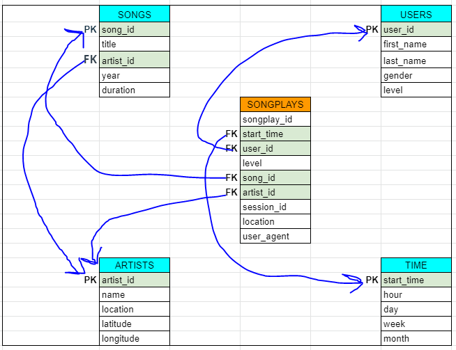

# Purpose of this project
This project creates an ETL pipeline used for the creation of the OLAP Sparkify database as a supporting tool to discover the insights like
users favourite songs and users listening behaviour through users activity analysis, and the songs users are listening repeatedly by hour, day, week, month and year.
It will help the company to understand its app users in a more better way, which eventual will improve the users experience with the app.

# ETL Process
1. To track users songs listening frquency, the timestamp is broken in different `units`, `minutes`, `hours`, `weekday` and `year`.
2. As the songs dataset has all the information in a combined form, it needs to be seperated out into different dimension tables `artists` and `songs`.
3. Logs data captures users activity as combined information, which needs to be seperated out, stored in `songsplay` fact table, `users` and `time` dimension table.  

1. Create `Songs`, `Users` and `Artists` dimension tables
2. Process Songs data
3. Extract data for the `Songs` table by selecting `song_id`, `title`, `artist_id`, `year`, `duration` from the songs data
4. Load the data to Songs table
5. Extract data for the `Artists` table by selecting the `artist_id`, `artist_name`, `artist_location`, `artist_latitude`, `artist_longitude` from the songs data
6. Load the data to `Artists` table
7. Process Logs data
8. Filter it for the `Next Song` data under `page` attribute
9. Extract `ts` from the processed Logs data
10. Transfrom `ts` to different units `timestamp(ms)`, `hour`, `day`, `week_of_year`, `month`, `year`, `weekday`
11. Load into the `time` dimension table 
12. Create `Songplays` fact table 
13. Extract `start_time`, `user_id`, `level`, `song_id`, `artist_id`, `session_id`, `location`, `user_agent`
14. Load the data into `SongPlays` table

# Steps to create the pipline and database
1. Run the `create.py` script (it will create the above mentioned fact table and dimension tables, drop if it exists alredy)
2. Run the `etl.py` (it perform the ETL process)
3. Test it by runing the test queries in the `test.ipynb` file

# Files in repository
1. create.py
2. etl.py
3. test.ipynb
3. Schema_Design.ipynb
4. etl.ipynb
5. sql_queries.py
6. data

   
